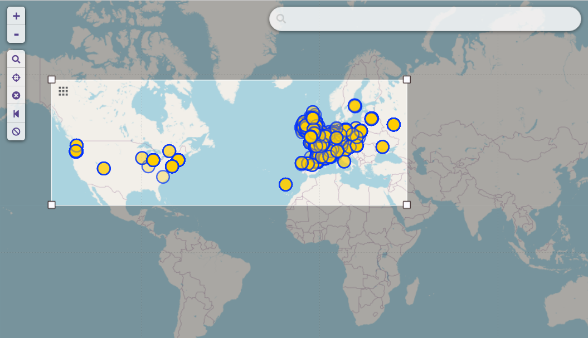

# Tactile Paving Mapper: Project Overview
---
- Scraped over 12,000 images and iterated through several CNN architectures to classify whether or not an image contained tactile paving
- Due to messy crowd-sourced data, models did no better than guessing. Future work is to manually label and localize tactile paving in images to create a tool to map accessibility resources in cities

## Problem
---
This project had many inspirations: [this](https://99percentinvisible.org/episode/curb-cuts/) 99 Percent Invisible podcast, [this](https://medium.com/towards-data-science/garbage-route-optimization-using-computer-vision-object-detection-17a217d5582d) trash mapping article, and [this](https://doras.dcu.ie/26261/) research paper.

People with vision problems need resources in the built world to help them navigate it. One of these resources are known as tactile paving: the usually yellow mats of raised bumps found at intersections. When someone using a cane feels this tactile paving, they know that they are at an intersection and should proceed with caution before walking across the intersection.

Cities should be built around the people that live there. But how do we know if our cities are, in fact, accessible and inclusive? What if we could push images of our cities through a machine learning model and produce a heatmap of where infrastructure building should be prioritized?

That is the goal of this project. A machine learning model with be trained to classify images based on whether tactile paving is detected or not. This can be used by city government and citizens alike to get a better understanding of the accessibility landscape of their built environment, wherever that may be.

## Tools
---
**Packages:** requests, matplotlib, tensorflow, keras

**Environment:** conda, Jupyter, VSCode

## Data
---
- Scraped over 12,000 images from OpenStreetMap and Mapillary
- Images are crowd sourced and open source; the quality might not be optimal
- A sample of images are provided in the `sample-images` folder. This contains the same directory structure as the images used in the models but only contains 10 of each split to serve as an example.
- All images were downloaded from [Mapillary](https://www.mapillary.com/). Mapillary does not endorse me or the use of the images in this project

Images labeled as having tactile paving and a Mapillary image:

## Model
---
- Models were built to classify images: 1 if tactile paving was detected in the image and 0 if tactile paving was not detected in the images
- Tried many simple CNN's built from scratch with convolutional and max pooling layers. Models had no statistical power (with a validation accuracy of 0.5, it had the same accuracy as simply guessing)
- Used a pre-trained VGG16 model as a base model. Used a custom classification head with flattening and fully connected layers. This model *barely* had statistical significance

## Future Work
---
- Fine tune VGG16 model
- Try other base models (XCeption, YOLO, ResNet, etc.)
- **Get better data by manually filtering and labelling images**
- **Get better data by using the `tactile_paving=contrasted` key in OSM.** This might be easier for the net to detect.
- Once sufficiently accurate: Map Bend, OR!

## References
---
- Venkatesh G M, Bianca Pereira, and Suzanne Little. Urban Footpath Image Dataset to Assess Pedestrian Mobility. *UrbanMM ’21, October 20–24, 2021, Virtual Event, China*
- Rodrigo Fuentes. Garbage Route Optimization Using Computer Vision Object Detection
- Francois Chollet. Deep Learning with Python. ISBN 9781617294433
- Philipp Schmid. Image Classification with Hugging Face Transformers and `Keras` (https://www.philschmid.de/image-classification-huggingface-transformers-keras). For dataset creation function.
